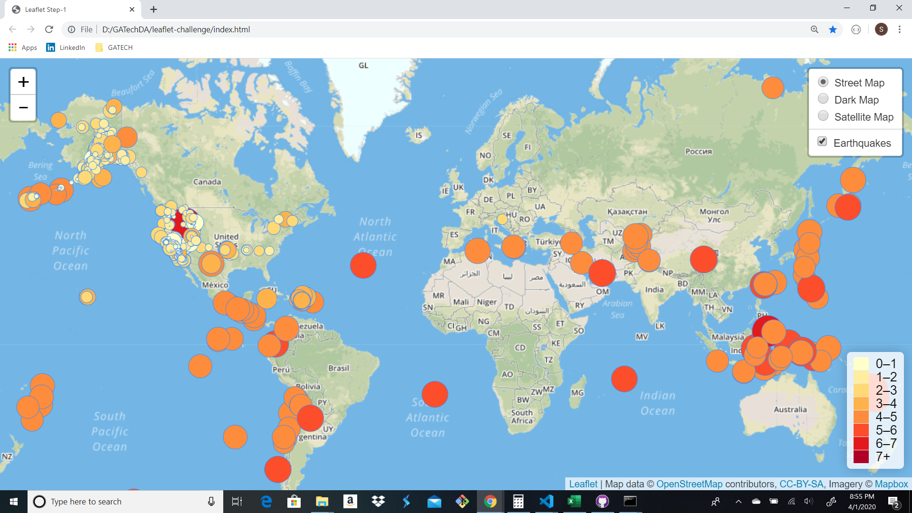
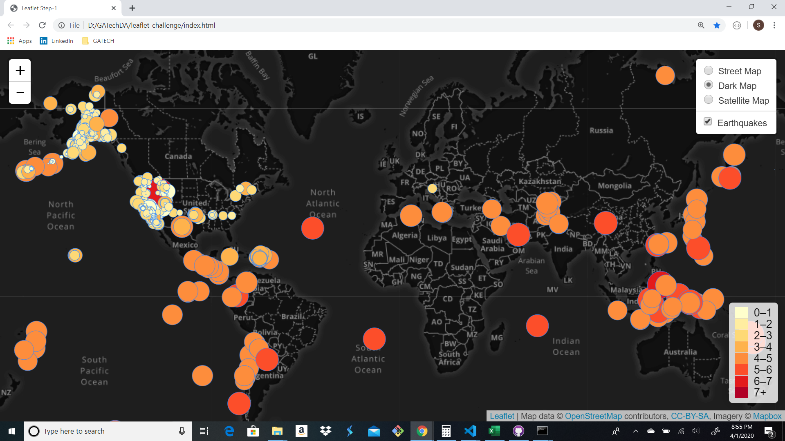

# Visualizing Data with Leaflet

### leaflet-challenge
---
Welcome to the United States Geological Survey, or USGS for short! The USGS is responsible for providing scientific data about natural hazards, the health of our ecosystems and environment; and the impacts of climate and land-use change. Their scientists develop new methods and tools to supply timely, relevant, and useful information about the Earth and its processes.

## Data Visualization

The visualizations below show the Earthquakes and other Seismic activity over the last 7 days using Leaflet. The markers both increase in size and intensity as the magnitude of the event increases. Reference the legend on the bottom right for reference. You can also click on the marker and be provided with addidional information such as location, magnitude, date and time of the event. The legend on the top right allows you to select a Dark or Satellite Map if needed.

