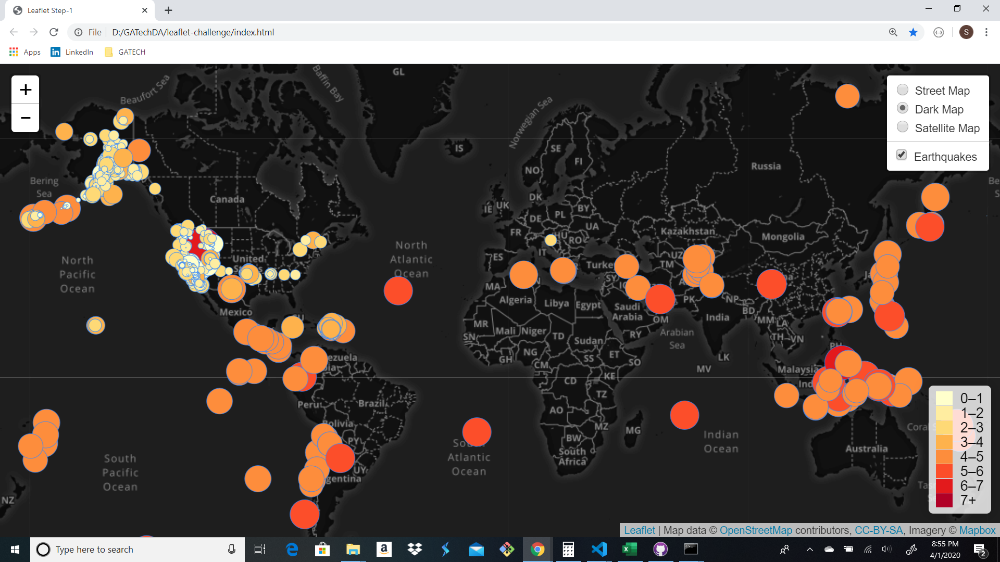
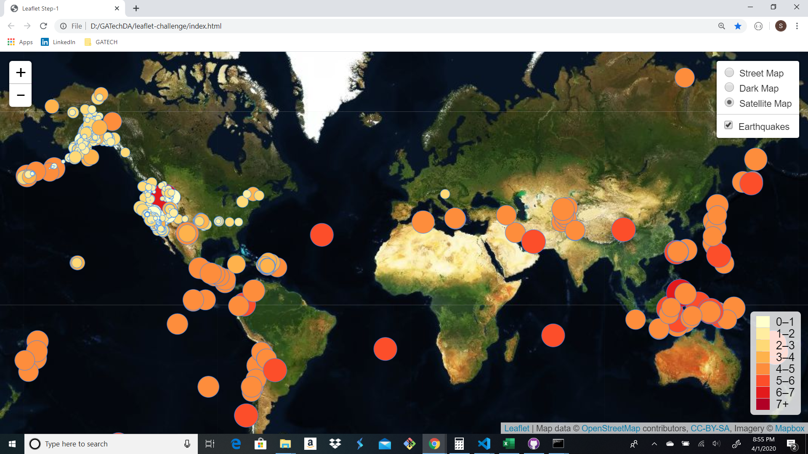

# Visualizing Data with Leaflet

### leaflet-challenge
---
The objective of this project is to identify Earthquakes and other Seismic activity utilizing the data from the United States Geological Survey, or USGS.

## Data Visualizations

The visualizations below show the Earthquakes and other Seismic activity over the last 7 days using Leaflet. The markers both increase in size and color intensity as the magnitude of the event increases. Use the legend on the bottom right for reference. You can also click on the marker and you will be provided with addidional information such as location, magnitude, date and time of the event. The legend on the top right allows you to select a Dark or Satellite Map if needed.

---

---

---
